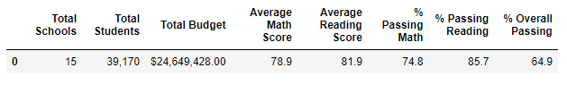
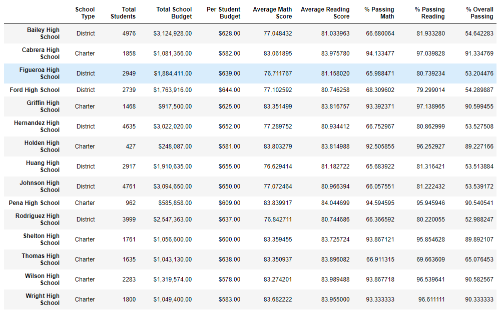
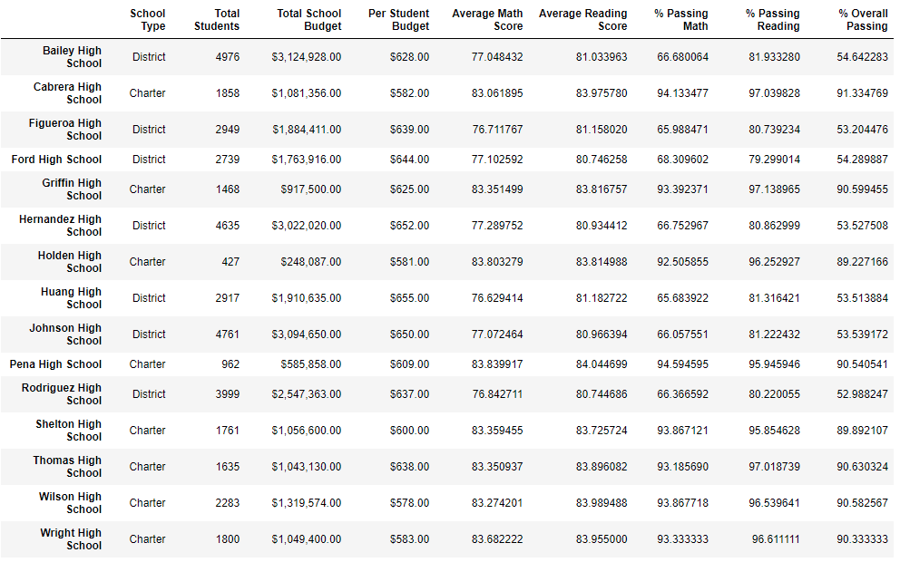
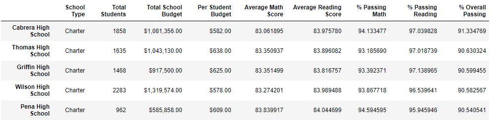
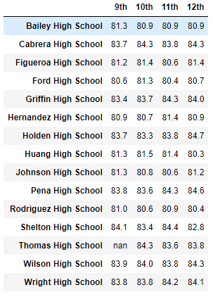
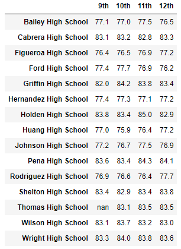

# School District Analysis

## Overview of the School District Analysis
A district school board has requested a breakdown of the results of their standardized testing. But first, an update to the data file is required in order to omit the math & reading scores for all of the 9th graders at Thomas High School while they investigate against potential academic dishonesty.

Here is the list of deliverables for the analysis of the school district: 

- A high-level snapshot of the district's key metrics, presented in a table format
- An overview of the key metrics for each school, presented in a table format
- Tables presenting each of the following metrics:
	- Top 5 and bottom 5 performing schools, based on the overall passing rate
	- The average math score received by students in each grade level at each school
	- The average reading score received by students in each grade level at each school
	- School performance based on the budget per student
	- School performance based on the school size 
	- School performance based on the type of school

## Resources
- Data Source: schools_complete.csv, students_complete.csv
- Software: Python 3.9.6, Conda 4.10.3

## Analysis Results
- How is the district summary affected?
	- I was able to omit all of the scores belonging to the 9th graders at Thomas High School, so the percentages shown in the district summary below are accurate for the district. Although, this caused the sample size of the data to decrease slightly and that should be taken into account when investigating any anomalies from the norm.
	

- How is the school summary affected?
	- The school summary was accurate for all schools with the exception of Thomas High School. 
	
	
	- The original analysis, as shown in the photo above, gives the wrong impression on the percentage of their students with passing grades in math and english.
	- I was able to adjust the code to have it omit the 9th graders from the calculation so that the data reflects the accurate percentages for Thomas High School. Although, once again, we must take into account that the analysis for Thomas High School is now working with a much smaller sample size than the other schools in the distrcit.
	

- How does replacing the ninth graders’ math and reading scores affect Thomas High School’s performance relative to the other schools?
	- As shown in the photo below, Thomas High School ranks second in overall passing percentage amongst the other schools in the district. This ranking, however, may be inaccurate due to the fact that the 9th graders from Thomas High School have unkown scores and were omitted from the analysis.
	

- How does replacing the ninth-grade scores affect the math and reading scores by grade?
	- The math and reading scores by grade were only affected in the 9th grade column with no score available for Thomas High School, as shown in the photo below, but all the other grade and school scores are accurate.

	
	

- How does replacing the ninth-grade scores affect scores by school spending, size, and type?
	- The analysis of scores based on school spending, size, and type were only impacted in that they used slightly smaller sample size. But the code did not require any alterations because the function to calculate the appropriate averages we required, from the updated per school dataframe, automatically omits any null values in the data.

## Summary
Changes in the updated school district analysis after the reading and math scores for the 9th graders at Thomas High School have been replaced:
1. The district summary dataframe required changes in it's calculation for the percentage of passing students to adjust for the students omitted from the analsis.
2. The per school summary dataframe required changes, and a correction, in it's calculation for the percentage of passing students to adjust for the students omitted from the analsis.
3. The per grade summary dataframe was altered and now reflects that there is no data available for the students in 9th grade at Thomas High School.
4. The average math and reading scores, as well as the percentages of students with passing grades for math and reading, at Thomas High School were all changed.
